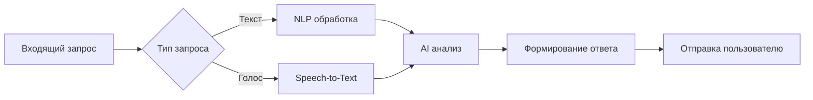
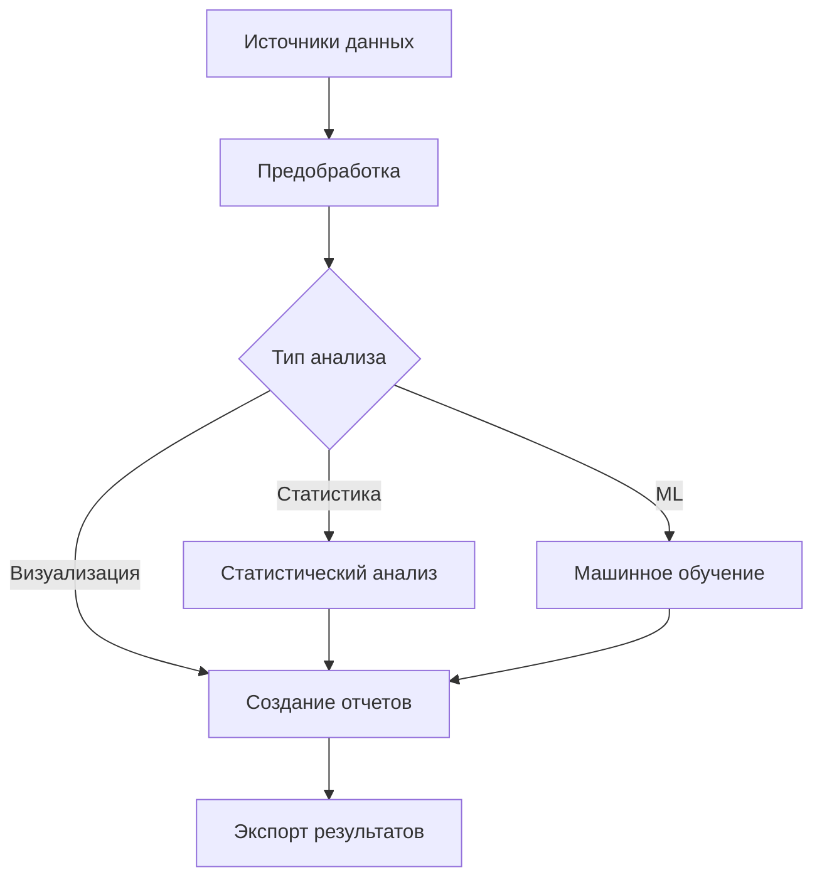
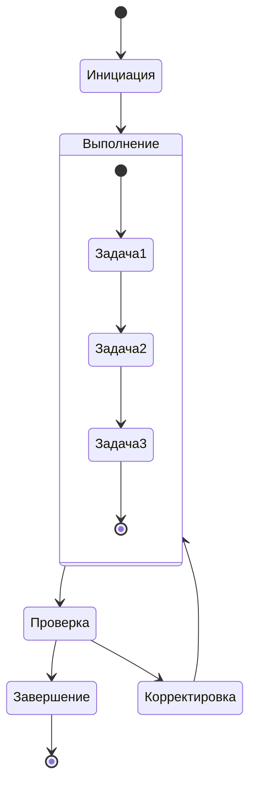
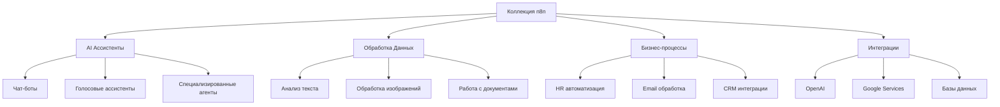
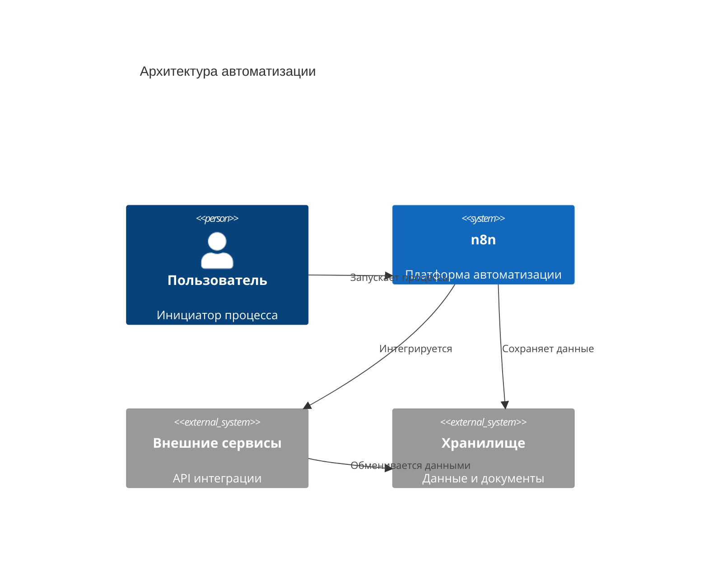
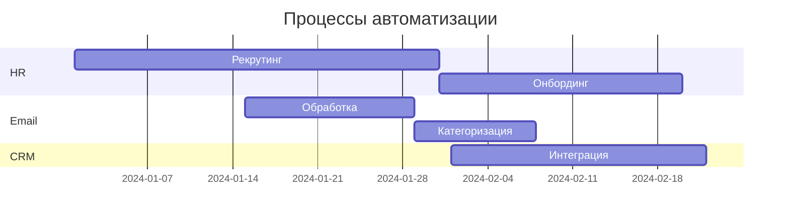

<div align="center">

# 🚀 Awesome n8n Templates

[](https://awesome.re)
[](https://opensource.org/licenses/MIT)
[](http://makeapullrequest.com)

*Коллекция продвинутых шаблонов автоматизации для платформы n8n*

[📚 Документация](https://docs.n8n.io) | [🌟 Начало работы](#-общее-описание) | [📦 Установка n8n](https://docs.n8n.io/getting-started/installation/)

</div>

---

## 📚 Содержание

<details open>
<summary><h3>📑 Быстрая навигация</h3></summary>

| Раздел | Описание | Статус |
|:-------|:----------|:--------|
| [🌐 Общее описание](#-общее-описание) | Обзор коллекции и её назначение | []() |
| [🔍 Категории воркфлоу](#-категории-воркфлоу) | Классификация рабочих процессов | []() |
| [⭐ Ключевые воркфлоу](#-ключевые-воркфлоу) | Основные процессы и связи | []() |
| [📋 Шаблоны](#-примечательные-шаблоны) | Выдающиеся примеры | []() |
| [🔧 Структура](#-техническая-структура) | Архитектура и компоненты | []() |
| [📝 Рекомендации](#-рекомендации-по-использованию) | Практики и советы | []() |
| [🚀 Развитие](#-потенциал-развития) | Планы расширения | []() |

</details>

---

## 🎯 Общее описание

<details open>
<summary><h3>📌 О проекте</h3></summary>

> 💡 **Коллекция автоматизированных рабочих процессов для n8n**

Проект представляет собой курируемый набор шаблонов для различных сценариев автоматизации, включающий:

- 🤖 Интеграции с AI-сервисами
- 📊 Инструменты анализа данных
- 🔄 Автоматизацию бизнес-процессов
- 🌐 Интеграции веб-сервисов

</details>

---

## 🔍 Категории воркфлоу

<details open>
<summary><h3>🤖 AI-ассистенты и чат-боты</h3></summary>

| Тип | Описание | Сложность | Статус |
|:-----|:----------|:------------|:--------|
| Персональные ассистенты | Поддержка голоса и текста | ⭐⭐ | []() |
| Бизнес чат-боты | Клиентская поддержка | ⭐⭐⭐ | []() |
| Мессенджер боты | Интеграции с Telegram, WhatsApp, Discord | ⭐⭐⭐⭐ | []() |



</details>

<details>
<summary><h3>📊 Обработка данных и аналитика</h3></summary>

| Категория | Инструменты | Интеграции |
|:-----------|:-------------|:-------------|
| 📈 Анализ данных | • Pandas<br>• NumPy<br>• Jupyter | Google Sheets, Excel |
| 📊 Визуализация | • Plotly<br>• Matplotlib<br>• D3.js | Tableau, PowerBI |
| 🤖 ML/AI | • TensorFlow<br>• PyTorch<br>• Scikit-learn | AWS, GCP, Azure |



</details>

<details>
<summary><h3>🔌 Интеграции с AI-сервисами</h3></summary>

| Сервис | Статус | Возможности | Документация |
|:--------|:---------|:-------------|:--------------|
| OpenAI | [](https://openai.com) | GPT, DALL-E | [Docs](https://platform.openai.com/docs) |
| Google Gemini | [](https://gemini.google.com) | Мультимодальный AI | [Docs](https://ai.google.dev/docs) |
| Mistral.ai | [](https://mistral.ai) | Открытые модели | [Docs](https://docs.mistral.ai) |
| Claude | [](https://anthropic.com) | Бизнес AI | [Docs](https://anthropic.com/claude) |
| Ollama | [](https://ollama.ai) | Локальные модели | [Docs](https://ollama.ai/docs) |

</details>

<details>
<summary><h3>🔄 Автоматизация бизнес-процессов</h3></summary>

| Процесс | Компоненты | Интеграции | Статус |
|:---------|:------------|:------------|:--------|
| HR Автоматизация | • Онбординг<br>• Учет времени<br>• Оценка KPI | Slack, Trello, Jira | []() |
| Документооборот | • Генерация документов<br>• Согласование<br>• Архивация | Google Docs, OneDrive | []() |
| CRM Процессы | • Лид-менеджмент<br>• Воронка продаж<br>• Аналитика | HubSpot, Salesforce | []() |



</details>

---

## 🌟 Ключевые воркфлоу

<details open>
<summary><h3>📊 Структура процессов</h3></summary>



</details>

---

## 🏆 Примечательные шаблоны

<details open>
<summary><h3>🔍 Топ шаблонов</h3></summary>

### 1️⃣ Интеллектуальный веб-поиск

[](https://brave.com/search/api/)

- 🔍 Использование Brave Search API
- 📊 Семантическое ранжирование
- 🤖 Интеграция с Google Gemini

### 2️⃣ OpenAI примеры (5-в-1)

[](https://openai.com)

- 💬 Интеграция ChatGPT
- 🎨 Генерация изображений DALL-E
- 🗣️ Распознавание речи Whisper

### 3️⃣ Персональный шоппер для WooCommerce

[](https://woocommerce.com)

- 🔄 RAG (Retrieval Augmented Generation)
- 📁 Интеграция с Google Drive
- 🛍️ Чат-бот для e-commerce

</details>

---

## 🔧 Техническая структура

<details>
<summary><h3>⚙️ Архитектура проекта</h3></summary>



<details>
<summary>📄 Структура JSON файлов</summary>

```json
{
  "workflow": {
    "metadata": {
      "name": "Example Workflow",
      "version": "1.0.0"
    },
    "nodes": [],
    "connections": {}
  }
}
```
</details>

</details>

---

## 📋 Рекомендации по использованию

<details open>
<summary><h3>📝 Основные шаги</h3></summary>

1. 📚 Изучить [документацию](https://docs.n8n.io) каждого воркфлоу
2. 🔐 Настроить необходимые учетные данные
3. 🧪 Протестировать в тестовой среде
4. ⚙️ Адаптировать параметры



</details>

---

## 🚀 Потенциал развития

<details open>
<summary><h3>📈 Планы развития</h3></summary>

- 🔄 Добавление новых интеграций
- 🔧 Расширение функциональности
- 🔗 Создание комбинированных решений
- ⚡ Оптимизация производительности

</details>

---

## 📜 Лицензия

Распространяется под лицензией MIT. См. файл [LICENSE](LICENSE) для получения дополнительной информации.

---

<div align="center">

[](https://star-history.com/#n8n-io/n8n&Date)

**Сделано с ❤️ для сообщества n8n**

</div>

        