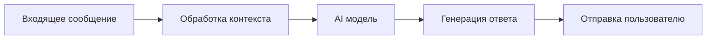

# 🤖 AI и машинное обучение

## 📑 Описание категории
Этот раздел содержит воркфлоу, связанные с искусственным интеллектом и машинным обучением. Здесь вы найдете автоматизации для работы с различными AI моделями, обработки естественного языка и компьютерного зрения.

## 🔍 Подкатегории

### 🗣️ Чат-боты и ассистенты
Воркфлоу для создания и управления AI-ассистентами и чат-ботами.

### 📝 Обработка естественного языка
Автоматизации для анализа и генерации текста, перевода и классификации документов.

### 👁️ Компьютерное зрение
Воркфлоу для работы с изображениями, распознавания объектов и анализа визуального контента.

### 🎨 Генерация контента
Автоматизации для создания текстов, изображений и других типов контента с помощью AI.

## 🔧 Основные интеграции
| Сервис | Описание | Примеры использования |
|--------|-----------|----------------------|
| OpenAI | API для работы с GPT моделями | Чат-боты, генерация текста |
| Stable Diffusion | Генерация изображений | Создание визуального контента |
| Hugging Face | Библиотека ML моделей | NLP задачи, классификация |

## 📚 Полезные ресурсы
- [Документация по AI нодам](https://docs.n8n.io/integrations/builtin/app-nodes/n8n-nodes-base.openai/)
- [Примеры использования ML моделей](https://n8n.io/blog/category/automation/)
- [Сообщество AI разработчиков](https://community.n8n.io/)