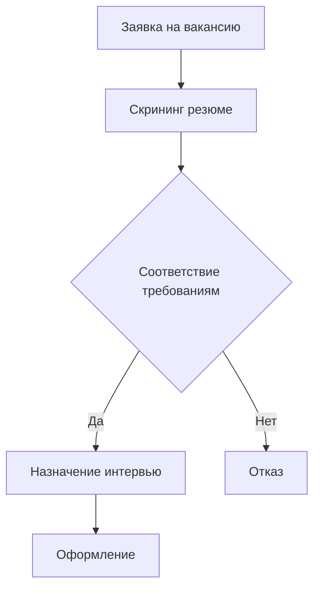

# 💼 Бизнес-процессы

## 📑 Описание категории
Раздел содержит воркфлоу для автоматизации различных бизнес-процессов, включая HR, CRM, документооборот и управление проектами.

## 🔍 Подкатегории

### 👥 HR автоматизация
Воркфлоу для управления персоналом и автоматизации HR процессов.

### 🤝 CRM интеграции
Автоматизации для работы с клиентами и управления продажами.

### 📄 Документооборот
Воркфлоу для управления документами и автоматизации бумажной работы.

### 📋 Управление проектами
Автоматизации для планирования, трекинга и управления задачами.

## 🔧 Основные интеграции
| Сервис | Описание | Примеры использования |
|--------|-----------|----------------------|
| Slack | Коммуникации | Уведомления, согласования |
| Jira | Управление проектами | Трекинг задач |
| Salesforce | CRM | Управление продажами |

## 📈 Типовые сценарии
1. Автоматизация найма сотрудников
2. Обработка заявок клиентов
3. Согласование документов
4. Управление задачами проекта

## 📚 Полезные ресурсы
- [Шаблоны бизнес-процессов](https://n8n.io/workflows/)
- [Интеграции для бизнеса](https://n8n.io/integrations/)
- [Кейсы автоматизации](https://n8n.io/blog/category/business/)