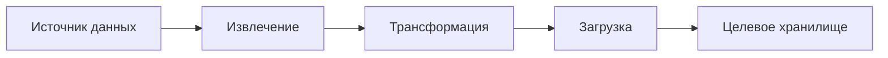

# 📊 Обработка данных

## 📑 Описание категории
Раздел содержит воркфлоу для работы с данными, их анализа, трансформации и визуализации. Здесь собраны автоматизации для ETL процессов, создания отчетов и аналитических дашбордов.

## 🔍 Подкатегории

### 📥 ETL процессы
Воркфлоу для извлечения, трансформации и загрузки данных.

### 📈 Анализ данных
Автоматизации для статистического анализа, агрегации и обработки данных.

### 📊 Визуализация
Воркфлоу для создания графиков, диаграмм и визуальных представлений данных.

### 📋 Отчетность
Автоматизации для генерации регулярных отчетов и мониторинга показателей.

## 🔧 Основные интеграции
| Сервис | Описание | Примеры использования |
|--------|-----------|----------------------|
| Google Sheets | Работа с таблицами | Сбор и анализ данных |
| PostgreSQL | База данных | Хранение и обработка данных |
| Tableau | Визуализация | Создание дашбордов |

## 📈 Типовые сценарии
1. Автоматический сбор данных из различных источников
2. Регулярная генерация отчетов
3. Мониторинг ключевых показателей
4. Создание аналитических дашбордов

## 📚 Полезные ресурсы
- [Документация по работе с данными](https://docs.n8n.io/data/)
- [Примеры ETL процессов](https://n8n.io/blog/category/data/)
- [Интеграции для анализа данных](https://n8n.io/integrations/)