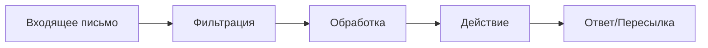

# 🔄 Интеграции

## 📑 Описание категории
Раздел содержит воркфлоу для интеграции различных сервисов и систем, включая email системы, социальные сети, базы данных и API.

## 🔍 Подкатегории

### 📧 Email системы
Воркфлоу для работы с электронной почтой и почтовыми сервисами.

### 📱 Социальные сети
Автоматизации для работы с различными социальными платформами.

### 💾 Базы данных
Воркфлоу для интеграции и синхронизации баз данных.

### 🔌 API интеграции
Автоматизации для работы с внешними API и веб-сервисами.

## 🔧 Основные интеграции
| Тип | Сервисы | Примеры использования |
|-----|----------|----------------------|
| Email | Gmail, Outlook | Автоматизация рассылок |
| Соцсети | Twitter, LinkedIn | Публикация контента |
| Базы данных | MySQL, MongoDB | Синхронизация данных |

## 📈 Типовые сценарии
1. Автоматическая обработка писем
2. Кросспостинг в соцсети
3. Синхронизация баз данных
4. Интеграция с внешними API

## 🔗 Протоколы и стандарты
- REST API
- GraphQL
- SMTP/IMAP
- OAuth 2.0

## 📚 Полезные ресурсы
- [Документация по интеграциям](https://docs.n8n.io/integrations/)
- [API справочник](https://docs.n8n.io/api/)
- [Примеры подключений](https://n8n.io/workflows/)